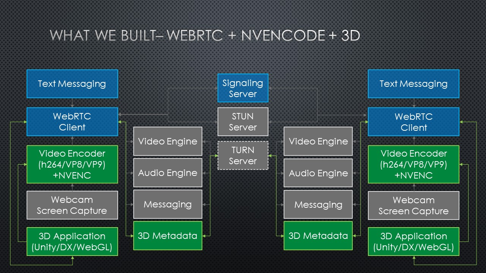
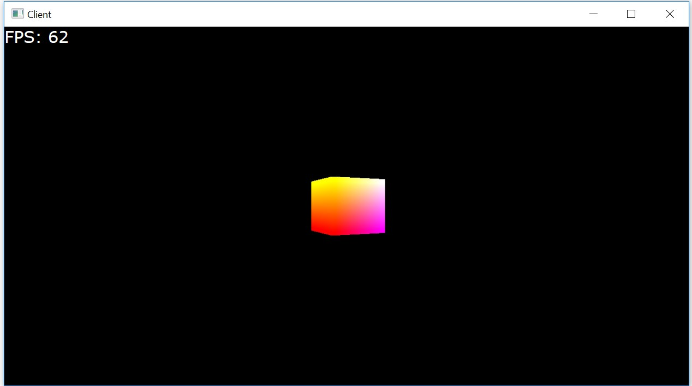

A toolkit for creating powerful cloud-based 3D experiences that stream to traditionally out of reach low-powered devices.


## What is this?

**Problem:** The world is becoming increasingly mobile, but the demand for high-fidelity 3D content is only growing. We needed a scalable approach to make this sort of content available on low-powered, low-bandwidth devices.

The 3DStreamingToolkit project's purpose is to provide an approach for developing 3D server applications that stream frames in real-time to other devices over the network. Specifically:

1. A server-side C++ plugin and samples for remotely rendering and streaming 3D scenes
2. Cross-platform client-side samples for receiving streamed 3D scenes, including HoloLens
3. Cloud infrastructure architecture to allow large-scale deployment 
4. Zero latency video compression using NvPipe/NVEncode
5. WebRTC extensions for 3D content and input



Here's a high-level diagram of the components we've built (in green), and how they interact with the underlying WebRTC and NVEncode technologies we've leveraged. 

## Getting Started

This toolkit is available as a native C++ plugin and can be added to any rendering engine to enable streaming over the network using WebRTC. Our client samples are the perfect starting point to test the streaming capability and interacting with the 3D scene. 

Every client and server application using this toolkit will need to connect to a signaling server and a TURN server. Before continuing, it is important that you familiarize with WebRTC and understand what servers are required for your solution. Please see this in-depth tutorial about [signaling](https://www.html5rocks.com/en/tutorials/webrtc/infrastructure/#what-is-signaling) and [STUN/TURN](https://www.html5rocks.com/en/tutorials/webrtc/infrastructure/#after-signaling-using-ice-to-cope-with-nats-and-firewalls).  


### 1. Signaling server

Our streaming solution is compatible with any standard WebRTC signalling implementation, however, in order to take advantage of multiple peers on one server and scaling features, we recommend [our signaling server](https://github.com/3DStreamingToolkit/signal-3dstk) implementation. The Deploy to Azure button will automatically spin up a server on your subscription. 

V1.3.0 onwards has full CORS support for running locally or in the cloud with http or https. Look at the [README and documentation](https://github.com/3DStreamingToolkit/signal-3dstk) on that page to see which extensions are available and supported. 


### 2. TURN server

As explained above, for most scenarios, servers and clients will be behind multiple layers of NAT, proxies and corporate firewalls. To enable streaming, it will be required to have a TURN server deployed and running. 

Please see our code story on [how to deploy a simple or load-balanced TURN](https://www.microsoft.com/developerblog/2018/01/29/orchestrating-turn-servers-cloud-deployment/).


### 3. Sample server and client applications

We strongly recommend running out pre-built samples for server and clients, before attempting to integrate the plugin into a new application. This will ensure that the network configuration is running properly. 

Any local or remote server machine that will be used for rendering and streaming, must have the following prerequisites:
•	The target machine must run Windows 10 or Windows Server 2016 and must have a compatible Nvidia GPU that can run Nvencode.
•	x64 Visual C++ Redistributable for Visual Studio 2015

> NOTE: you can use a non-Nvidia GPU for testing as it will automatically switch to software encoding, however, we do not recommend using that in production as the latency and FPS will be greatly affected. 

You can download and unzip any of the server/clients from our latest release. Our easiest pair to start with is [DirectX-NativeClient-v2.0](https://github.com/3DStreamingToolkit/3DStreamingToolkit/releases/download/v2.0/3DStreamingToolkit-DirectX-NativeClient-v2.0.zip) and [DirectX-SpinningCubeServer-v2.0](https://github.com/3DStreamingToolkit/3DStreamingToolkit/releases/download/v2.0/3DStreamingToolkit-DirectX-SpinningCubeServer-v2.0.zip). 

### 4. WebRTC Configuration (webrtcConfig.json) 

3DSTK’s sample server applications make use of an external JSON configuration file (webrtcConfig.json) to manage the connections to the Signaling and TURN services. Below is an example webrtcConfig.json file. This file contains placeholders for server addresses from your server setup in step 1 and 2. This file is found in the executable directory.  

```
{
  "iceConfiguration": "relay",
  "turnServer": {
    "uri": "turn:<url>:5349",
    "username": "<username>",
    "password": "<password>"
  },
  "server": "<url>",
  "port": 80
  "heartbeat": 5000
}

```
Our sample clients use the same configuration options but depending on the platform, it might be part of a json file or part of the source code. For example, our [DirectX-NativeClient-v2.0](https://github.com/3DStreamingToolkit/3DStreamingToolkit/releases/download/v2.0/3DStreamingToolkit-DirectX-NativeClient-v2.0.zip) uses the same webrtcConfig.json as part of the executable directory and our [WebClient-v2.0](https://github.com/3DStreamingToolkit/3DStreamingToolkit/releases/download/v2.0/3DStreamingToolkit-WebClient-v2.0.zip) has the config options as part of the app.js
```
 var defaultSignalingServerUrl = 'http://localhost:3001';
  var pcConfigStatic = {
    'iceServers': [{
        'urls': 'turn server goes here',
        'username': 'username goes here',
        'credential': 'password goes here',
        'credentialType': 'password'
    },
    {
      'urls': 'stun:stun.l.google.com:19302'
    }],
    'iceTransportPolicy': 'relay'
  };

```

### 5. Streaming your first scene 

Before trying to connect the server and client, make sure you set the **SAME** signalling and TURN url for **BOTH** the client and the server webrtc configurations. 

Simply open the client and server sample apps and press the connect button. You will now see the client/server appearing in the “List of currently connected peers”.

To start streaming, double click on the client/server name and the real-time interaction will begin. You can use the client app to click and drag to move the camera in the scene.   

> This is the output of the DirectXSpinningCube server when connected to a DirectX native client. 


After connecting, you should be seeing success! If you're instead seeing errors, check out the [Troubleshooting guide](https://github.com/3DStreamingToolkit/3DStreamingToolkit/wiki/FAQ) and then [file an issue](https://github.com/3DStreamingToolkit/3DStreamingToolkit/issues/new). Additionally, you can see more information about our other sample implementations [here](https://github.com/3DStreamingToolkit/3DStreamingToolkit/wiki/Feature-matrices).

## How to build the toolkit

These steps will ensure your development environment is configured properly, and then they'll walk you through the process of building our code.

#### Prerequisites 

+ Windows 10 Anniversary Update / Windows Server 2012 R2 / Windows Server 2016 (see [which version of Windows you have](https://binged.it/2xgQqRI)) 
+ [Visual Studio 2017](https://docs.microsoft.com/en-us/visualstudio/releasenotes/vs2017-relnotes)
+ [Windows 10 SDK - 10.0.14393.795](https://developer.microsoft.com/en-us/windows/downloads/sdk-archive)
+ [Latest NVIDIA driver](http://www.nvidia.com/Download/index.aspx) (required for NVEncode)
+ [CUDA Toolkit 9.1](https://developer.nvidia.com/cuda-downloads) (required for NVEncode)
+ [Unity 2017.4.4f1 LTS release](https://unity3d.com/unity/qa/lts-releases) (Optional, but required for Unity server and client samples) 

#### Installing dependencies

> Note: Before running our `setup.cmd` script, please ensure powershell is set to [enable unrestricted script execution](https://docs.microsoft.com/en-us/powershell/module/microsoft.powershell.core/about/about_execution_policies?view=powershell-5.1&viewFallbackFrom=powershell-Microsoft.PowerShell.Core). The `setup.cmd` script will use `AzCopy` if installed, which will speed up the dependency downloads. Download the latest stable `AzCopy` from http://aka.ms/downloadazcopy.

Run `.\setup.cmd` from the command line. This will install and configure the following:

+ 32bit and 64bit Debug, Release, Exes, Dlls and PDBs from this commit [Chromium m62 release](https://chromium.googlesource.com/chromium/src/+/0971c880c3f82e5fdbc6d65d1fc4d8ae9aa47ddc)
+ [M62 WebRTC native and UWP extensions](https://github.com/3DStreamingToolkit/webrtc-extensions-3dstk), which add nvencode support, frame prediction (for HoloLens), video frame updates and native buffers to webrtc. These will be applied to the above
+ Pre-built [NvPipe library](https://github.com/3DStreamingToolkit/NvPipe/tree/low-latency-optimization) used in our WebRTC extension to enable NVIDIA-accelerated zero latency video compression
+ [CUDA Toolkit 9.1](https://developer.nvidia.com/cuda-downloads) pre-built Release libraries used by NvPipe - cudart64_91 and nvToolsExt64_1
+ 32bit and 64bit Debug and Release libraries for DirectX Toolkit 
+ Release libraries for OpenGL - Freeglut, Glew and glext

Once you see `Libraries retrieved and up to date` you may proceed.

#### The actual build

+ Open [the 3DStreamingToolkit solution](./3DStreamingToolKit.sln) in Visual Studio
+ Build the solution (Build -> Build Solution) in the desired configuration (Build -> Configuration Manager -> Dropdowns at the top). We encourage using  `Release` and `x64`.
+ Done!
> Note: We no longer support x86 server builds that are using nvencode. This is due to 32-bit support gradually being deprecated/removed from CUDA. 

If you're seeing errors, check out the [troubleshooting guide](https://github.com/3DStreamingToolkit/3DStreamingToolkit/wiki/FAQ) and then [file an issue](https://github.com/3DStreamingToolkit/3DStreamingToolkit/issues/new).


### Next Steps

These resources will be critical to your success in configuring and scaling applications.

+ [Sample implementation configuration files](https://github.com/3DStreamingToolkit/3DStreamingToolkit/wiki/JSON-Config-Files)
+ [Configuring authentication](https://github.com/3DStreamingToolkit/3DStreamingToolkit/wiki/Configuring-authentication)

### Learn More

+ [Building WebRTC from source](https://github.com/3DStreamingToolkit/3DStreamingToolkit/wiki/Building-WebRTC-from-source)
+ [WebRTC Homepage](https://webrtc.org/)
+ [NVEncode Homepage](https://developer.nvidia.com/nvidia-video-codec-sdk)
+ [NvPipe original source](https://github.com/NVIDIA/NvPipe)
