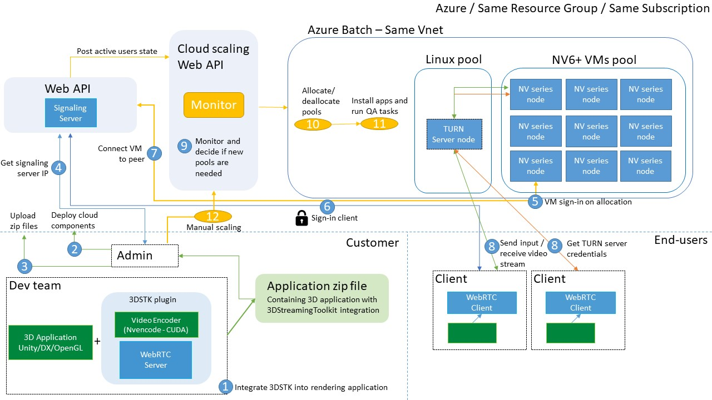

## Introduction

3DStreamingToolkit's purpose is to allow building powerful stereoscopic 3D experiences that run on the cloud and stream to low-powered devices. To achieve this, a large-scale architecture is required that has all the required WebRTC servers (signaling and TURN) and an orchestrator capable of monitoring and scaling up/down pools of VMs that host the rendering applications. Clients can easily connect to the signaling server and the orchestrator will decide what VM should connect to the user.

All the required components can be found in the following GitHub repository:
[https://github.com/3DStreamingToolkit/cloud-deploy](https://github.com/3DStreamingToolkit/cloud-deploy)

## Reference architecture



This architecture is a great starting point for anyone looking to create an enterprise-grade large-scale solution for remote rendering in the cloud. The flow (steps 1-13) shows how any team can deploy these components and allow end-users to connect to the desired experience. More specifically: 

1. The dev team takes a rendering application (DirectX, OpenGL, Unity) and integrates the 3D Streaming Toolkit. On each release, the executable and dependencies are zipped and versioned. 
2. The team deploys all required components to Azure (signaling web api, scaling web api, Vnet and azure batch) and sets the configuration (maximum active users, VMs per pool, max users per VM, etc.)
3. All releases from step 1 are uploaded to Azure Batch for deployment on pool creation. 
4. Once the signaling server is up and running, the IP must be public and shared. This is the entry point to all clients and servers and must be integrated to any published client. 
5. Once a client has a successful login from an end-user, it will automatically connect to signaling server. 
6. The signaling server will select the best available VM and connect the client to the experience. If no slots are available, it will wait until one is ready. 
7. The real-time streaming starts between the VM and client. The preferred TURN server credentials are sent down to the client dynamically and the video, audio and data channels will pass through the TURN server to the VM. This will ensure streaming will work with any proxy or corporate firewall and no public IP is exposed on the VM level. 
8. For each active client connection, a status is sent to the orchestrator to decide if new pools are needed. This is based on the configuration set at step 2 and can be fully customized for any scenario. 
9. The cloud scaling api will monitor the status of Azure Batch pools and based on the configuration, it will decide if new pools are needed, or, delete inactive ones. 
10. If a new pool is needed, it will trigger a request to Azure Batch to create pool of NV6+ VMs. New TURN server nodes will be created if the existing ones are at full capacity. 
11. Once a new pool is created, the scaling api will trigger tasks to install dependencies, install the streaming applications and run all functional tests to ensure the VM is ready for streaming.
12. When a VM is ready, the streaming application will automatically connect to the signaling server and will be assigned to a queue to await client connections.
13. At any point, the cloud admin can use the Azure Batch portal to decide if new pools are needed. A simple POST request will run the automated process add more VMs. This can also be scheduled if a high uptake of users is predicted during a certain time of the day.

Key components:
1. Signaling Server Web API  
2. Orchestrator and cloud scaling Web API 
3. Azure Batch 

### Signaling Server Web API

This enables webrtc peer communication across the 3DStreamingToolkit server/client stack. This means that it can be used to facilitate communication between N clients, N peers, and/or both. It uses http as a protocol and can run over https as well. Further, authentication can be toggled on, requiring clients to provide valid OAuth 2.0 tokens to successfully access the service. 

### Orchestrator and cloud scaling Web API

To make it easier to spin up the necessary VMs for a 3DSTK server environment, a Web API endpoint has been provided. This will dynamically monitor the overall active users and capacity and decide when to create or delete pools of VMs inside Azure Batch to sustain a desired number of active users. Each pool creation will add the correct dependencies, install the custom applications, connect the VM to the signaling server and ensure that each application is ready for streaming. The Web API project uses `ASP.NET` and it requires [Visual Studio 2017](https://visualstudio.com/vs) (v15.7 or higher).

Below is a sample snippet of the JSON input that can be provided:

```json
{
  "signalingServer": "SIGNALING_URI", // Required
  "signalingServerPort": 80, // Required
  "renderingPoolId": "RENDERING_POOL_ID",
  "renderingJobId": "RENDERING_JOB_ID",
  "dedicatedRenderingNodes": 1,
  "maxUsersPerRenderingNode": 1,
  "turnPoolId": "TURN_POOL_ID",
  "dedicatedTurnNodes": 1
}
```

### Azure Batch

Azure Batch allows you to run large-scale parallel and high-performance computing (HPC) apps efficiently in the cloud. You can schedule compute-intensive work to run on pools of virtual machines, run tasks on those VMs, monitor the state and scale as needed.

More info on Azure Batch: [https://docs.microsoft.com/en-us/dotnet/api/overview/azure/batch?view=azure-dotnet](https://docs.microsoft.com/en-us/dotnet/api/overview/azure/batch?view=azure-dotnet)

The 3D Streaming Toolkit requires at least 1 Linux virtual machine to act as a [TURN](https://en.wikipedia.org/wiki/Traversal_Using_Relays_around_NAT) server and a pool of Windows Server virtual machines to run the rendering engine on NVIDIA GPUs. Azure Batch allows us to spin up these VMs (i.e. compute nodes) in their own pools, within a designated virtual network (vnet).

Please note that "_The virtual network must be in the same region and subscription as the Azure Batch account. The specified subnet should have enough free IP addresses to accommodate the number of nodes in the pool. If the subnet doesn't have enough free IP addresses, the pool will partially allocate compute nodes, and a resize error will occur._"

More info on setting NetworkConfiguration.SubnetId: [https://docs.microsoft.com/en-us/dotnet/api/microsoft.azure.batch.networkconfiguration.subnetid?view=azure-dotnet#Microsoft_Azure_Batch_NetworkConfiguration_SubnetId](https://docs.microsoft.com/en-us/dotnet/api/microsoft.azure.batch.networkconfiguration.subnetid?view=azure-dotnet#Microsoft_Azure_Batch_NetworkConfiguration_SubnetId)

# Setting up the cloud architecture

To get started on deploying the architecture on your own subscription, please follow our tutorial here: 

# Features & Limitations

There are some features and limitations to be aware of when using Azure Batch:
* When using [CloudServiceConfiguration](https://docs.microsoft.com/en-us/dotnet/api/microsoft.azure.batch.cloudserviceconfiguration?view=azure-dotnet), _only_ Windows VMs can be generated.
* When using [VirtualMachineConfiguration](https://docs.microsoft.com/en-us/dotnet/api/microsoft.azure.batch.virtualmachineconfiguration?view=azure-dotnet), _both_ Windows and Linux VMs can be generated.
* The Batch Service use [VM Scale Sets](https://docs.microsoft.com/en-us/azure/virtual-machine-scale-sets/virtual-machine-scale-sets-overview) to provide Linux compute nodes. 
* When using a VM Configuration, an image can be used from the [Azure Marketplace](https://azure.microsoft.com/marketplace/virtual-machines/) or from a custom image.
* Windows VM sizes must be selected from [sizes available for Windows on Azure](https://docs.microsoft.com/en-us/azure/virtual-machines/windows/sizes?toc=%2fazure%2fvirtual-machines%2fwindows%2ftoc.json). 
* Linux VM sizes must be selected from one of the [sizes available for Linux on Azure](https://docs.microsoft.com/en-us/azure/virtual-machines/linux/sizes?toc=%2fazure%2fvirtual-machines%2flinux%2ftoc.json). 
* If using a [custom image](https://docs.microsoft.com/en-us/azure/batch/batch-custom-images), the VM image must reside in the same region and subscription as the Azure Batch account.
* For the Web API implementation, [SharedKeyCredentials](https://docs.microsoft.com/en-us/dotnet/api/microsoft.azure.batch.auth.batchsharedkeycredentials?view=azure-dotnet) are enough to create a VM in Batch, but a custom image would require [TokenCredentials](https://docs.microsoft.com/en-us/dotnet/api/microsoft.azure.batch.auth.batchtokencredentials?view=azure-dotnet) which needs [Azure AD](https://docs.microsoft.com/en-us/azure/batch/batch-aad-auth) for authentication.

# Resources & Links
* [Azure Batch website](https://azure.microsoft.com/en-us/services/batch/)
* [Batch Documentation](https://docs.microsoft.com/en-us/azure/batch/)
* [Azure Batch in a Virtual Network](https://docs.microsoft.com/en-us/azure/batch/batch-virtual-network)
* [Batch Samples on GitHub](https://github.com/Azure/azure-batch-samples)
* [Azure Code Samples](https://azure.microsoft.com/en-us/resources/samples/?service=batch&sort=0)